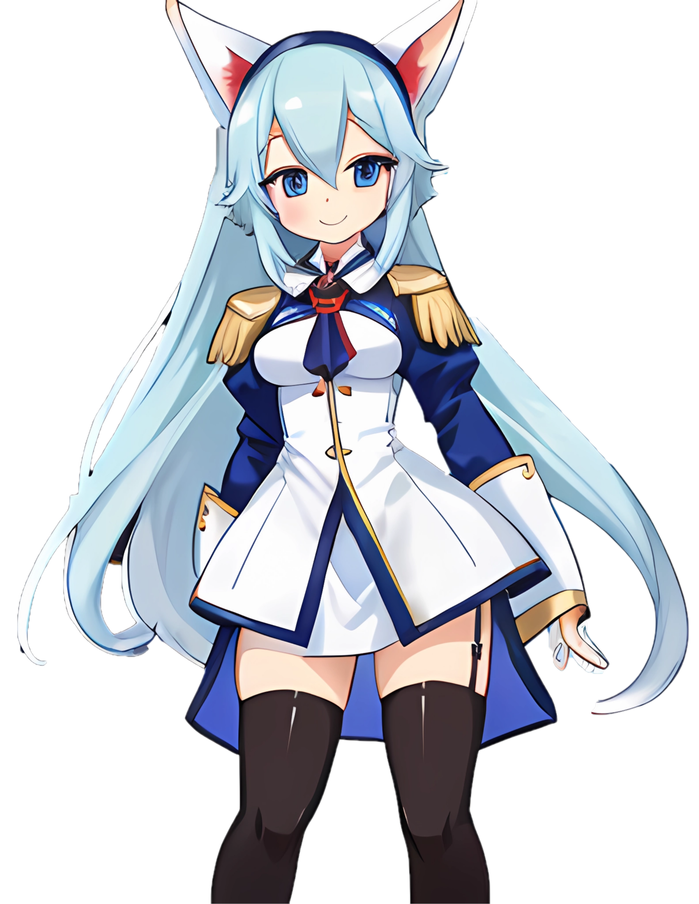

# Scuffed Anime Collection

This is my personal collection of 'scuffed' anime-style images generated by myself.

When using older models and low step-counts, generative AI often produces artifacts such as broken hands, impossible props and scruffy edges. Sometimes, the combination of these artifacts makes a very artistic result. I refer to this intentionally-rough style as 'scuffed'.

## Collection

### [SQLette](Collection/SQLetteInfo.md)

My first 'scuffed' character generated on 2024-12-10. The left hand is malformed and twisted, and the eyes are chiseled like gemstones. Originally created for my [SQLiteSharp](https://github.com/Joy-less/SQLiteSharp) project, SQLette is now the reference for this collection.

### [Jessie](Collection/JessieInfo.md)

This adventurer has a top with a rune-shaped cutout and two belts fused into one. Her backpack and dagger/pen are strangely designed.

### [Levia](Collection/LeviaInfo.md)

This demon from hell has a hand that seems to melt into their cup. It's difficult to tell whether their appendages are wings, ears, coat-tails, or even mouths.

## Process

'Scuffed' images can be generated on [Dezgo](https://dezgo.com) with an older model like [FurryToonMix](https://dezgo.com/model/furrytoonmix) or [FurryToonMixV2](https://civitai.com/models/470339/furrytoonmixv2). Reduce the number of steps to 10-15, and AI-upscale the image with [Bigjpg](https://bigjpg.com).

## License

This collection was created by [Joyless](https://github.com/Joy-less) and is licensed under [CC-BY 4.0](LICENSE.md).